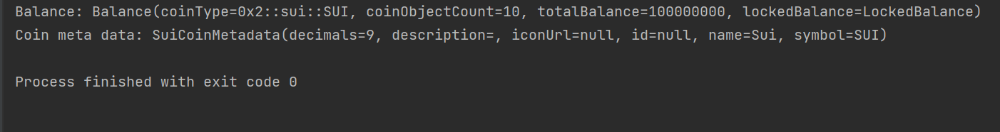

<h1 align="center">Ksui - KMP Library for Sui</h1>

Ksui, /keɪˈsuːiː/ (pronounced as "kay-soo-ee"), is a collection of Multiplatform Kotlin language JSON-RPC wrapper and crypto utilities for interacting with a Sui Full node.

This library is intended to be the highest quality publicly available library for interacting with Sui on any Kotlin-supported platform by epitomizing expressiveness, conciseness and aesthetics


[](LICENSE)
[](https://search.maven.org/artifact/xyz.mcxross.ksui/ksui)
[](https://github.com/mcxross/ksui/actions/workflows/docs-publish.yml)


# Table of contents
- [Features](#features)
- [Quick start](#quick-start)
- [What's included](#whats-included)
- [Projects using Ksui](#Projects-using-Ksui)
- [Contribution](#contribution)

## Features
- Implements all functions
- HTTP and WebSocket Clients
- Crypto wrappers
- Client Configurable
- Multiplatform

## Quick Start

### Installation

#### Multiplatform
Add the `Ksui` dependency to the common sourceSet

```kotlin
implementation("xyz.mcxross.ksui:ksui:<$ksui_version>")
```
#### Platform specific (Android, JS, Native, JVM)
Add the `Ksui` dependency to the Project's dependency block

Generic:

```kotlin
implementation("xyz.mcxross.ksui:<ksui-[platform]>:<$ksui_version>")
```
For example for Android and JS

Android:

```kotlin
implementation("xyz.mcxross.ksui:ksui-android:<$ksui_version>")
```

JS:

```kotlin
implementation("xyz.mcxross.ksui:ksui-js:<$ksui_version>")
```

##### RPC HTTP Client
Create a new instance of the Sui RPC HTTP Client. The client can be configured with the following options:
- `endpoint`: The Sui endpoint to connect to. Defaults to `EndPoint.DEVNET`
- `agentName`: The name of the agent making the request. Defaults to `KSUI/0.0.1`
- `maxRetries`: The maximum number of times to retry a request. Defaults to `5`
- and many more. Check documentation for more details.

After the client is configured, it can be used to invoke remote procedures e.g. `getBalance`, `getCheckpoints` and `getCoins`. Check the [Sui JSON-RPC documentation](https://docs.sui.io/sui-jsonrpc) for a list of available RPCs.

The client supports both DSL and command-query styles for client creation and RPC calls respectively as shown below:
```kotlin
//Configure Client, DSL Style
val suiHttpClient = suiHttpClient {
    endpoint = EndPoint.DEVNET
    agentName = "KSUI/1.2.0-beta"
    maxRetries = 10
}
//Invoke remote procedure, command-query style
val balance = suiHttpClient.getBalance(SuiAddress("0x4afc81d797fd02bd7e923389677352eb592d55a00b65067fa582c05f62b4788b"))
val coinMetadata = suiHttpClient.getCoinMetadata("0x2::sui::SUI")
```



##### RPC WebSocket Client
Create a new instance of the Sui RPC WebSocket Client. The client can be configured similarly to the http client.
After the client is configured, subscribe to events with `subscribeEvent`

```kotlin
//Configure Client, DSL Style
val suiWSClient = suiWebSocketClient { endpoint = EndPoint.MAINNET }

suiWSClient.subscribeEvent(
        eventFilterFor<EventFilter.Combined> { operator = Operator.ALL },
        onSubscribe = {},
        onError = {}) {
    // This block of code is a trailing lambda that will be executed whenever an event occurs.
    // It has access to the `eventEnvelope` object, which represents the details of the event.
}
```

For more information, please see the [documentation](https://mcxross.github.io/ksui/).

## What's included
| File/Folder      | Description                                                                                             |
|------------------|---------------------------------------------------------------------------------------------------------|
| [lib](lib)       | Library implementation folder. It contains the code for Ksui that can be used across multiple platforms |
| [sample](sample) | Samples on how to use the exported APIs                                                                 |

## Projects using Ksui

- [Sui Cohesive](https://github.com/mcxross/sui-cohesive)

## Contribution

All contributions to Ksui are welcome. Before opening a PR, please submit an issue detailing the bug or feature. When opening a PR, please ensure that your contribution builds on the KMM toolchain, has been linted with `ktfmt <GOOGLE (INTERNAL)>`, and contains tests when applicable. For more information, please see the [contribution guidelines](CONTRIBUTING.md).